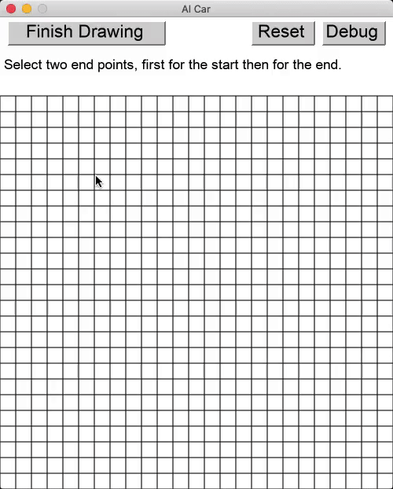

# AI Car

This is meant to be a small simulation of the A* Algorithm fused with steering behvaiours to make a car find an optimal path and move from start to goal, avoiding obstacles.



## Getting Started

Python 3.6+

(Arcade runs on Windows, Mac OS X, and Linux. Arcade requires Python 3.6 or newer. It does not run on Python 2.x though Pymunk runs on both versions of python.)

### Installing

You will only need to install the arcade and pymunk libraries for graphics and physics simulation.

More information on [arcade](https://arcade.academy/installation.html) here.
More information on [pymunk](http://www.pymunk.org/en/latest/installation.html) here.

```
pymunk==5.6.0
arcade==2.3.10
```

I've included them in requirements.txt

## License

This project is licensed under the MIT License - see the [LICENSE.md](LICENSE.md) file for details.

## Sources of Knowledge

1. I had originally created an implementation in JavaScript using [p5.js](https://www.youtube.com/watch?v=aKYlikFAV4k&t=17s) with the help of [this awesome man](youtube.com/channel/UCvjgXvBlbQiydffZU7m1_aw).
2. [A great playlist](https://www.youtube.com/playlist?list=PLFt_AvWsXl0cq5Umv3pMC9SPnKjfp9eGW) on A* Algorithm and Optimization (also includes threading, which I haven't implemented. A good playlist overall.)
3. [Craig Reynold's](https://www.red3d.com/cwr/steer/gdc99/) steering forces. Also summed up into a playlist by [Daniel Shiffman](https://www.youtube.com/watch?v=JIz2L4tn5kM&list=PLRqwX-V7Uu6YHt0dtyf4uiw8tKOxQLvlW).